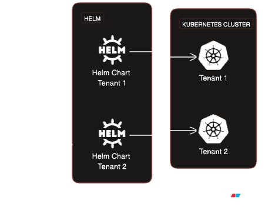

# Deploying a Multitenant Application 

## Prereq
- [Terraform](https://developer.hashicorp.com/terraform/downloads)
- [k3d](https://k3d.io/v5.5.1/)
- [Docker](https://docs.docker.com/engine/install/)



## Deployment

Create `terraform.tfvars` and add inputs similar to;
```
cluster_name     = "multi-tenant"
app_domain       = "10-0-10-10.sslip.io"
kube_config_file = "~/.kube/config"
docker-sock      = "unix:///var/run/docker.sock"
app_name         = "app1"
image_tag        = "v2"
tenants          = ["tenant-a", "tenant-b", "tenant-c"]
container_port   = 3000
```
The run;
```
terraform init
terraform plan
terraform apply -auto-approve
```
<!-- BEGIN_TF_DOCS -->
## Requirements

| Name | Version |
|------|---------|
| <a name="requirement_docker"></a> [docker](#requirement\_docker) | ~> 3.0.2 |
| <a name="requirement_helm"></a> [helm](#requirement\_helm) | ~> 2.10.1 |
| <a name="requirement_k3d"></a> [k3d](#requirement\_k3d) | 0.0.7 |
| <a name="requirement_kubectl"></a> [kubectl](#requirement\_kubectl) | ~> 1.14 |
| <a name="requirement_kubernetes"></a> [kubernetes](#requirement\_kubernetes) | ~> 2.22.0 |
| <a name="requirement_template"></a> [template](#requirement\_template) | ~> 2.2.0 |
| <a name="requirement_time"></a> [time](#requirement\_time) | ~> 0.9.1 |

## Providers

| Name | Version |
|------|---------|
| <a name="provider_docker"></a> [docker](#provider\_docker) | 3.0.2 |
| <a name="provider_external"></a> [external](#provider\_external) | 2.3.3 |
| <a name="provider_helm"></a> [helm](#provider\_helm) | 2.10.1 |
| <a name="provider_k3d"></a> [k3d](#provider\_k3d) | 0.0.7 |
| <a name="provider_template"></a> [template](#provider\_template) | 2.2.0 |
| <a name="provider_terraform"></a> [terraform](#provider\_terraform) | n/a |

## Modules

No modules.

## Resources

| Name | Type |
|------|------|
| [docker_image.tenant](https://registry.terraform.io/providers/kreuzwerker/docker/latest/docs/resources/image) | resource |
| [helm_release.ingress](https://registry.terraform.io/providers/hashicorp/helm/latest/docs/resources/release) | resource |
| [helm_release.tenant](https://registry.terraform.io/providers/hashicorp/helm/latest/docs/resources/release) | resource |
| [k3d_cluster.k3d](https://registry.terraform.io/providers/pvotal-tech/k3d/0.0.7/docs/resources/cluster) | resource |
| [terraform_data.image-import](https://registry.terraform.io/providers/hashicorp/terraform/latest/docs/resources/data) | resource |
| [external_external.getip](https://registry.terraform.io/providers/hashicorp/external/latest/docs/data-sources/external) | data source |
| [template_file.tenant](https://registry.terraform.io/providers/hashicorp/template/latest/docs/data-sources/file) | data source |

## Inputs

| Name | Description | Type | Default | Required |
|------|-------------|------|---------|:--------:|
| <a name="input_app_name"></a> [app\_name](#input\_app\_name) | application name | `string` | `"pyapp"` | no |
| <a name="input_cluster_image"></a> [cluster\_image](#input\_cluster\_image) | Cluster iamge | `string` | `"rancher/k3s:v1.27.4-k3s1"` | no |
| <a name="input_cluster_name"></a> [cluster\_name](#input\_cluster\_name) | cluster\_name | `string` | `"demo"` | no |
| <a name="input_container_port"></a> [container\_port](#input\_container\_port) | Container Port | `number` | `5000` | no |
| <a name="input_docker-sock"></a> [docker-sock](#input\_docker-sock) | Docker socket | `string` | `"unix:///var/run/docker.sock"` | no |
| <a name="input_tenants"></a> [tenants](#input\_tenants) | List of tenants | `list(string)` | <pre>[<br>  "tenant-a"<br>]</pre> | no |

## Outputs

| Name | Description |
|------|-------------|
| <a name="output_endpoints"></a> [endpoints](#output\_endpoints) | Tenant FQDN |
<!-- END_TF_DOCS -->